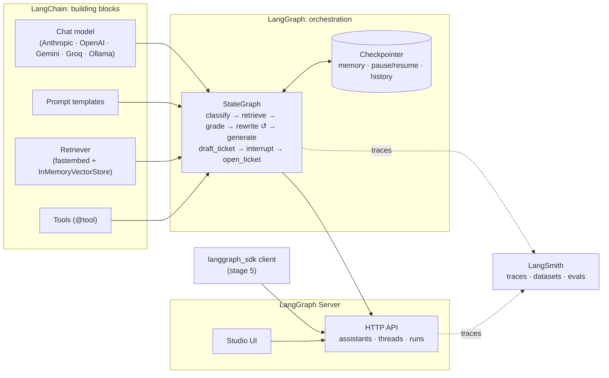
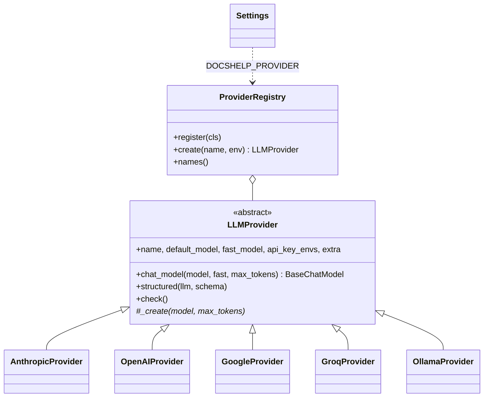

# DocsHelp: the LangChain ecosystem, one stage at a time

[](https://github.com/RGB314/docshelp/actions/workflows/ci.yml)

A small but realistic app, a support assistant for the made-up product **Nimbus Notes**, built in five stages.
Each stage adds one product from the LangChain ecosystem, so you can see exactly what each one contributes.

| Stage | Product | What it adds | Script |
|---|---|---|---|
| 1 | **LangChain** | One interface for any LLM; prompt templates; composing steps with `\|` (LCEL); streaming, batching, structured output | `stages/01_langchain_basics.py` |
| 2 | **LangChain** | Answering from your own documents (RAG): loaders, splitters, embeddings, vector store, retriever; tools and a tool-calling agent | `stages/02_langchain_rag.py` |
| 3 | **LangGraph** | Control flow you define (branches, loops), shared state, memory, human-in-the-loop approval, full state history | `stages/03_langgraph_agent.py` + `src/docshelp/graph.py` |
| 4 | **LangSmith** | Tracing of every run, test datasets, automated evaluation, side-by-side comparison of experiments | `stages/04_langsmith_eval.py` |
| 5 | **LangGraph Server + Studio** | The same graph served as an API (threads, runs, streaming, interrupts) plus a visual debugger | `langgraph.json` + `stages/05_langgraph_server.py` |

## How the pieces fit together



In one sentence each:
- **LangChain** is the standard library: models, prompts, retrievers and tools behind common, swappable interfaces.
- **LangGraph** is the runtime for agents: you define the steps as a graph, and it handles state, persistence, loops and pausing for a human.
- **LangSmith** is observability and quality: see every step of every run, and measure whether a change made the app better or worse.
- **LangGraph Server / Studio** is deployment and debugging: turn a graph into a production-style API without writing web code, and inspect it visually.

## Runs the same on Windows, macOS and Linux

Pick whichever way of running suits you. All three give the same pinned Python 3.12 environment from `uv.lock`,
and use the same commands.

| Option | You install | Best for |
|---|---|---|
| **A. uv (recommended)** | [uv](https://docs.astral.sh/uv/) only. It fetches Python 3.12 itself. | Fastest; runs natively. Any OS, any shell. |
| **B. Docker Compose** | [Docker Desktop](https://www.docker.com/products/docker-desktop/) (or Docker Engine) | Zero local Python; the whole stack (app + LangGraph Server + optional Ollama) in containers |
| **C. Dev Container** | VS Code + Docker, or nothing at all with GitHub Codespaces | A ready-made editor environment, one click from GitHub |

Every command in this README is the same in **PowerShell, cmd, Git Bash, macOS and Linux**: `uv run poe <task>`,
powered by [poethepoet](https://poethepoet.natn.io/). The few steps that differ by shell are shown side by side.
Run `uv run poe` to list all tasks.

Under the hood:
- Paths use `pathlib`.
- Output is forced to UTF-8, so Windows pipes and Git Bash don't crash on ✓ or ⏸.
- `.gitattributes` keeps line endings as LF everywhere.
- Helper tasks are written in Python instead of shell scripts.

## Prerequisites

| What | Required? | Why |
|---|---|---|
| uv, **or** Docker | Yes | See the options above. uv installs Python 3.12 and all dependencies into `.venv`. |
| **One** model provider (see below) | Yes | Every stage calls a chat model. Pick any supported provider, including free ones. |
| LangSmith API key | Optional (needed for stage 4 in LangSmith) | Tracing and evaluation. Without it, stage 4 runs its evaluation locally. |
| Internet access | Yes | For downloads, plus a one-time ~70 MB embedding model. With Ollama, the stages then run fully offline. |
| ~1.5 GB disk | Yes | Python, the virtual environment and the model cache (plus ~5 GB per model if you use Ollama). |

### Supported model providers

| `DOCSHELP_PROVIDER` | Cost | Default model / fast model | Key (env var) | Get it |
|---|---|---|---|---|
| `anthropic` (default) | Paid | `claude-sonnet-5` / `claude-haiku-4-5` | `ANTHROPIC_API_KEY` | [Claude Console](https://console.anthropic.com/settings/keys) |
| `openai` | Paid | `gpt-5.4-mini` / `gpt-5-mini` | `OPENAI_API_KEY` | [OpenAI Platform](https://platform.openai.com/api-keys) |
| `google` | Free tier | `gemini-3.8-flash` / `gemini-3.5-flash-lite` | `GOOGLE_API_KEY` (or `GEMINI_API_KEY`) | [Google AI Studio](https://aistudio.google.com/apikey) |
| `groq` | Free tier | `openai/gpt-oss-120b` / `openai/gpt-oss-20b` | `GROQ_API_KEY` | [GroqCloud](https://console.groq.com/keys) |
| `ollama` | Free, local | `qwen3:8b` / `qwen3:4b` | none (`OLLAMA_BASE_URL` optional) | [Ollama](https://ollama.com/download) |

Override the models with `DOCSHELP_MODEL` / `DOCSHELP_FAST_MODEL`. Model names change often; check your
provider's model list if a default is retired. Free tiers have rate limits, and stage 4 makes about 50 calls,
so it may run slowly on them. Small local models are noticeably weaker at tool use and structured output
than the hosted ones.

### 1. Install uv (one time, Option A only)

Use the official standalone installer. It puts `uv` in a fixed folder (`~/.local/bin`; on Windows
`%USERPROFILE%\.local\bin`) and adds that folder to your PATH once. Updates replace the file in place, so you
never touch PATH again.

**Windows** (the same line works in PowerShell, cmd and Git Bash):
```powershell
powershell -ExecutionPolicy ByPass -c "irm https://astral.sh/uv/install.ps1 | iex"
```
**macOS / Linux:**
```bash
curl -LsSf https://astral.sh/uv/install.sh | sh
```
Open a **new** terminal (Git Bash picks up the Windows PATH change too), then check it with `uv --version`.
Later, update with `uv self update`.

> Don't install uv with `pip install --user uv`. That puts it in a Python-version-specific folder
> (e.g. `...\Python\Python314\Scripts`) that changes whenever you upgrade Python.

### 2. Set up your model provider

<details>
<summary><b>Anthropic</b> (paid)</summary>

1. Sign in or sign up at the [Claude Console](https://console.anthropic.com) (it may redirect to `platform.claude.com`).
2. Add credits under **Settings → Billing**. API usage is prepaid and separate from any Claude.ai subscription.
   A few dollars is plenty for this demo.
3. **Settings → API Keys → Create Key**, and copy it immediately (it starts with `sk-ant-` and is shown once).
</details>

<details>
<summary><b>OpenAI</b> (paid)</summary>

Sign in at <https://platform.openai.com>, add credits under **Settings → Billing**, then create a key at
**API keys → Create new secret key**.
</details>

<details>
<summary><b>Google Gemini</b> (free tier)</summary>

Sign in to [Google AI Studio](https://aistudio.google.com/apikey) with a Google account and click **Create API key**.
No payment details are needed for the free tier.
</details>

<details>
<summary><b>Groq</b> (free tier)</summary>

Sign up at <https://console.groq.com>, then **API Keys → Create API Key**. No payment details are needed for the free tier.
</details>

<details>
<summary><b>Ollama</b> (free, runs on your machine, no key)</summary>

1. Install Ollama from <https://ollama.com/download> and make sure it's running.
2. Download the models: `ollama pull qwen3:8b` and `ollama pull qwen3:4b` (8 GB+ of free RAM recommended;
   a GPU helps a lot). On a smaller machine, use `qwen3:4b` for both via `DOCSHELP_MODEL`.

With Docker (Option B) you can skip installing Ollama: `docker compose --profile ollama up -d ollama`, then
`docker compose exec ollama ollama pull qwen3:8b` (repeat the pull for `qwen3:4b`). The models are kept in a Docker volume.
</details>

### 3. (Optional) Get a LangSmith API key

Sign up at <https://smith.langchain.com> (the free tier is enough), then go to **Settings → API Keys → Create API Key**.

## Setup

### Option A: uv

```bash
uv sync --extra ollama       # use your provider: anthropic | openai | google | groq | ollama
uv run poe setup             # creates .env from .env.example, then checks your provider setup
```

Each provider's LangChain integration is an optional extra, so you install only what you use.
`uv sync --all-extras` installs all five. Plain `uv sync` removes extras, so always repeat
the `--extra` flag when you re-sync. `uv run` leaves them alone.

### Option B: Docker Compose

```bash
docker compose build                        # image with all five provider integrations + the embedding model
docker compose run --rm app poe init-env    # or copy .env.example to .env yourself
docker compose run --rm app poe doctor
```

Inside containers the commands are the same as Option A, just prefixed with `docker compose run --rm app`
instead of `uv run`. Compose passes the values in your `.env` to the containers at run time. Put your keys
there: variables set in your host shell are *not* passed into containers. The `.env` file itself is **never**
copied into the image (see `.dockerignore`).

### Option C: Dev Container / GitHub Codespaces

Open the repo in VS Code and choose **Reopen in Container**, or on GitHub click **Code → Codespaces → Create**.
The container installs uv and all extras, creates `.env`, and forwards port 2024. Then use the Option A commands
in its terminal.

### Configure `.env` (all options)

Edit `.env`:
- `DOCSHELP_PROVIDER`: your provider (e.g. `ollama`).
- The API key for that provider only. The other key lines can stay empty.
- `LANGSMITH_API_KEY` is **optional but recommended**. With it and `LANGSMITH_TRACING=true`, every stage is
  traced automatically with no code changes.

**Keeping keys out of git:** settings are read only from environment variables. `.env` is just a
convenient way to set them locally, and it's git-ignored, so only `.env.example` (with empty values) is committed.
You can skip `.env` entirely and set real environment variables instead:

| PowerShell | Git Bash / macOS / Linux |
|---|---|
| `$env:DOCSHELP_PROVIDER = "groq"` | `export DOCSHELP_PROVIDER=groq` |
| `$env:GROQ_API_KEY = "gsk_..."` | `export GROQ_API_KEY=gsk_...` |

Real environment variables take priority over `.env`. Run `uv run poe doctor` at any time to see which providers
are ready. If a key is missing, the stages exit with a message saying which variable to set and where to get it.

Embeddings run locally on your CPU (`BAAI/bge-small-en-v1.5` via fastembed). The first run downloads about 70 MB into `.cache/`.

## Running the stages

| Task | Option A (uv, any shell) | Option B (Docker, any shell) |
|---|---|---|
| Stage 1–4 | `uv run poe stage1` … `stage4` | `docker compose run --rm app poe stage1` … `stage4` |
| Stage 3, no prompt | `uv run poe stage3 --auto-approve` | `docker compose run --rm app poe stage3 --auto-approve` |
| Stage 5 server | `uv run poe server` | `docker compose up -d server` |
| Stage 5 client | `uv run poe stage5` (second terminal) | `docker compose run --rm app poe stage5` |
| Tests | `uv run poe test` | `docker compose run --rm app poe test` |
| Provider check | `uv run poe doctor` | `docker compose run --rm app poe doctor` |

The tasks are thin wrappers, so `uv run python stages/01_langchain_basics.py` works too (forward slashes work in every shell).

### Stage 1: LangChain basics
```bash
uv run poe stage1
```
Covers a direct model call, `prompt | llm | parser`, streaming, a support email turned into a validated Pydantic
object, `batch()`, and swapping to the provider's smaller model with one argument (`get_llm(fast=True)`).
Swapping the *provider* needs no code change at all: set `DOCSHELP_PROVIDER` and re-run.
**Look for:** in section 2 the model *guesses* about offline mode, because it hasn't seen the docs yet.

### Stage 2: RAG and a tool-calling agent
```bash
uv run poe stage2
```
Ingests `data/docs/` (load → split by Markdown headings → embed → store), runs a semantic search, then a RAG chain
built with LCEL. Finally it runs `create_agent` with two tools, `search_docs` and `quote_price`, on a question that needs both.
**Look for:** "get my money back" finds the *Refunds* section with no shared keywords. The agent decides on its
own to call both tools.

### Stage 3: LangGraph agent
```bash
uv run poe stage3                   # you approve or reject the ticket
uv run poe stage3 --auto-approve
```
The graph (`src/docshelp/graph.py`) routes each message by intent, grades the retrieved docs, rewrites the
query and retries if they're irrelevant, and pauses with `interrupt()` before opening a support ticket.
**Look for:**
- the node-by-node path printed for each turn
- turn 2 ("can an admin still get *them* back?") resolved using earlier turns (memory via the checkpointer)
- the run *stopping* until you approve
- the snapshot count at the end (time travel)
- `graph.mmd`, a diagram of the graph (paste it into <https://mermaid.live>)

### Stage 4: LangSmith evaluation
```bash
uv run poe stage4
```
Uploads `data/eval_dataset.json` as a LangSmith dataset, then evaluates two systems on it: the plain RAG chain
(stage 2) and the LangGraph agent (stage 3). There are two evaluators:
- an **LLM-as-judge** that checks each answer against the reference answer
- a **code check** that the right source document was retrieved

**Look for:** in LangSmith → *Datasets & Experiments* → `docshelp-qa`, select both experiments and click **Compare**.
You'll see per-question scores, latency, token cost, and a link to each full trace.
Also open *Tracing Projects* → `docshelp-demo` to see traces from stages 1–3.
Without a LangSmith key the script runs the same evaluation locally and prints the scores.

### Stage 5: LangGraph Server and Studio
```bash
uv run poe server       # terminal 1: API on :2024, opens Studio in your browser
uv run poe stage5       # terminal 2: SDK client
```
With Docker, run `docker compose up -d server`, then open
<https://smith.langchain.com/studio/?baseUrl=http://127.0.0.1:2024> for Studio.
`langgraph.json` points the server at `src/docshelp/server.py:graph`. The client creates a thread, streams a run,
detects the approval interrupt, and resumes it through the API.
**Look for:** Studio shows the graph live. You can chat, watch each node run, edit state, and re-run from any
step. The same client code works against a cloud deployment (LangSmith Deployment); only the URL changes.

## Project layout

```
data/docs/              8 short Markdown pages documenting the made-up product
data/eval_dataset.json  9 question / reference-answer / expected-source examples
src/docshelp/
  config.py             Settings (from env vars), get_llm / structured_llm facades, local fastembed embeddings
  providers/
    base.py             LLMProvider (abstract base) + ProviderRegistry (factory)
    vendors.py          Anthropic, OpenAI, Google Gemini, Groq and Ollama providers
  ingest.py             load → split → embed → InMemoryVectorStore → retriever
  tools.py              search_docs and quote_price tools, save_ticket (writes data/tickets.jsonl)
  graph.py              the LangGraph agent (dependencies injectable for tests)
  server.py             graph instance for LangGraph Server
  console.py            UTF-8 terminal output on every OS
  tasks.py              init-env and doctor helpers behind `poe`
stages/                 the five runnable walkthroughs
tests/                  offline tests: scripted fake LLM + fake embeddings, no keys needed
langgraph.json          LangGraph Server / Studio config
pyproject.toml          dependencies, provider extras, and the `poe` task definitions
Dockerfile              container image (uv + locked deps + pre-downloaded embedding model)
compose.yaml            app, server and optional ollama services
.devcontainer/          VS Code Dev Container / GitHub Codespaces config
.gitattributes          LF line endings on every OS
```

## Tests

```bash
uv sync --all-extras    # once, so the provider tests can build each vendor's model class
uv run poe test         # unit + integration, ~1 min
uv run poe e2e          # end-to-end, ~2 min
```
Both suites run offline with no API keys.

**End-to-end tests** (`tests/e2e/`):
- Every stage runs as a real process with no keys and must exit with clear setup instructions (no tracebacks).
- A real LangGraph Server serves the real graph (scripted model), and the real stage 5 client drives it through a
  question, the approval interrupt and the resume.
- With `DOCSHELP_E2E_MODEL` set and Ollama running, all five stages also run against a real local model, still
  with no keys:
  ```bash
  ollama pull qwen2.5:0.5b
  # PowerShell: $env:DOCSHELP_E2E_MODEL = "qwen2.5:0.5b"; uv run poe e2e
  DOCSHELP_E2E_MODEL=qwen2.5:0.5b uv run poe e2e
  ```

**CI** (`.github/workflows/ci.yml`) runs both suites natively on Ubuntu, Windows and macOS. A `docker-e2e` job
builds the image and runs the suites in the container, including the real-model stages against the compose
`ollama` service, then checks the compose `server` + stage 5 path.

The unit tests cover:
- **the graph:** every path (happy path, rewrite-and-retry loop, multi-turn memory, ticket approve/reject through
  `interrupt()` + `Command(resume=...)`)
- **providers:** key lookup from env, missing-key and missing-package errors, model/fast-model/max-token handling,
  structured-output strategy, registry behaviour
- **settings:** parsing and validation of every `DOCSHELP_*` variable
- **repo hygiene:** no machine-specific paths, `.env` git-ignored, `.env.example` documents every provider with empty
  values, every provider has a pyproject extra, and no stage hard-codes a vendor
- **portability:**
  - UTF-8 output on non-UTF-8 streams, and the `poe` tasks and helpers
  - Dockerfile uses the lockfile and matching Python version; `.dockerignore` keeps secrets out
  - compose services and networking; Dev Container config; LF line endings

## How the provider layer is designed



- **Strategy:** each provider knows how to build its vendor's chat model and which structured-output method
  suits it (Groq uses tool calling; the others use native JSON schema). App code calls `get_llm()` /
  `structured_llm()` and never names a vendor.
- **Template Method:** `LLMProvider.chat_model()` always runs *check setup → pick model → build*. Subclasses
  implement only `_create()`.
- **Registry + Factory:** `@registry.register` adds a provider; `registry.create(name)` builds it.
- **Dependency injection:** providers and `Settings.from_env()` take the environment mapping to read, so tests pass
  fake environments and real keys only ever come from env vars.

**Adding a provider** (e.g. Mistral) touches no existing code:
1. Add an extra in `pyproject.toml`: `mistral = ["langchain-mistralai"]`.
2. Add a class in `providers/vendors.py`:
   ```python
   @registry.register
   class MistralProvider(LLMProvider):
       name = display_name = extra = "mistral"
       module = "langchain_mistralai"
       api_key_envs = ("MISTRAL_API_KEY",)
       default_model, fast_model = "mistral-medium-latest", "mistral-small-latest"
       signup_url = "https://console.mistral.ai/api-keys"

       def _create(self, model, max_tokens, **kwargs):
           from langchain_mistralai import ChatMistralAI
           return ChatMistralAI(model=model, api_key=self.api_key(), max_tokens=max_tokens, **kwargs)
   ```
3. Add `MISTRAL_API_KEY=` to `.env.example`. The hygiene tests will remind you if you forget.

## Contributing

`main` is protected: changes go in through pull requests, and CI must pass on all four checks (three operating
systems plus Docker). See [AGENTS.md](AGENTS.md) for the project rules. It's written for AI coding agents, but
it's just as useful for humans. `CLAUDE.md` points Claude Code at it.

## Notes and next steps

- Embeddings always run locally with fastembed, whichever chat provider you choose, so RAG works the same
  (and costs nothing) everywhere.
- `InMemorySaver` / `InMemoryVectorStore` keep the demo dependency-free. For production, swap in
  `langgraph-checkpoint-postgres` and a persistent vector store; the rest of the code doesn't change.
- Ideas to extend it:
  - load tools from an MCP server with `langchain-mcp-adapters`
  - try LangChain's `deepagents` for planning and sub-agents
  - add `HumanInTheLoopMiddleware` or `SummarizationMiddleware` to the stage 2 agent
  - deploy with `langgraph build` / LangSmith Deployment
